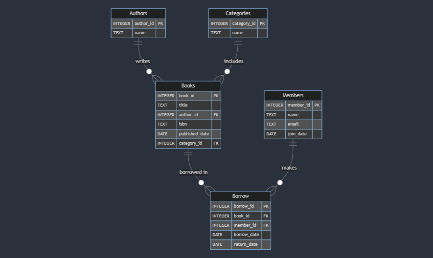

# Design Document for Library Management System

## By Roaa Mohamed

## [Video Overview](https://www.youtube.com/watch?v=nEn834NeTdM)

## Project Overview

The Library Management System is designed to manage the inventory of books, track borrowing activities, and maintain records of library members. The system supports functionalities such as book cataloging, tracking borrow records, and managing member information.

## Purpose

The purpose of this database is to:
- Maintain a catalog of books, authors, and categories.
- Track borrowing activities by members.
- Manage library member information.

## Scope

This database encompasses the following aspects:
- Storage of book information including title, author, ISBN, publication date, and category.
- Recording of authors and categories.
- Management of members and their borrowing activities.

## Entities and Relationships

### Entities

1. **Authors**
   - `author_id`: INT (Primary Key, Auto Increment)
   - `name`: VARCHAR(255) (Not Null)

2. **Categories**
   - `category_id`: INT (Primary Key, Auto Increment)
   - `name`: VARCHAR(255) (Not Null)

3. **Books**
   - `book_id`: INT (Primary Key, Auto Increment)
   - `title`: VARCHAR(255) (Not Null)
   - `author_id`: INT (Foreign Key referencing Authors)
   - `isbn`: VARCHAR(13) (Unique)
   - `published_date`: DATE
   - `category_id`: INT (Foreign Key referencing Categories)

4. **Members**
   - `member_id`: INT (Primary Key, Auto Increment)
   - `name`: VARCHAR(255) (Not Null)
   - `email`: VARCHAR(255) (Unique, Not Null)
   - `join_date`: DATE (Not Null)

5. **Borrow**
   - `borrow_id`: INT (Primary Key, Auto Increment)
   - `book_id`: INT (Foreign Key referencing Books)
   - `member_id`: INT (Foreign Key referencing Members)
   - `borrow_date`: DATE (Not Null)
   - `return_date`: DATE

### Relationships

- **Authors** to **Books**: One-to-Many. One author can write multiple books.
- **Categories** to **Books**: One-to-Many. One category can have multiple books.
- **Members** to **Borrow**: One-to-Many. One member can borrow multiple books.
- **Books** to **Borrow**: One-to-Many. One book can be borrowed multiple times (over time).

### Entity-Relationship Diagram (ERD)

### As detailed by the diagram:
- Each book can have 0 to many borrow records. A book has no borrow records if it has never been borrowed, and many borrow records if it has been borrowed by multiple members or multiple times. Each borrow record is associated with one and only one book.

- Each member can have 0 to many borrow records. A member has no borrow records if they haven’t borrowed any books, and many borrow records if they have borrowed multiple books or borrowed the same book multiple times. Each borrow record is associated with one and only one member.

- Each borrow record is associated with one and only one book and one and only one member. A book or member can have 0 to many borrow records, depending on how many times it is borrowed or how many books a member has borrowed.

- Each author can have 0 to many books. An author has no books if none of their works are in the library, and many books if they have written multiple works in the library. Each book is associated with one and only one author.

- Each category can be associated with 0 to many books. A category has no books if no books belong to that category, and many books if multiple books belong to the same category. Each book is associated with one and only one category.

- Each book belongs to one and only one category, and each category can have multiple books.

## Optimizations

1. **Indexes**:
   - Indexes on `author_id` and `category_id` in the `Books` table to speed up lookups and joins.
   - Index on `return_date` in the `Borrow` table for efficient querying of overdue books.

2. **Views**:
   - `BookDetails` view provides a comprehensive view of book details including author and category names, simplifying complex queries.

## Limitations

1. **Scalability**:
   - The database may face performance issues with a very large number of records or complex queries. Consider partitioning and additional indexing for large-scale implementations.

2. **Data Integrity**:
   - While foreign keys ensure referential integrity, manual checks are required to ensure that all data entries adhere to expected formats and constraints.
